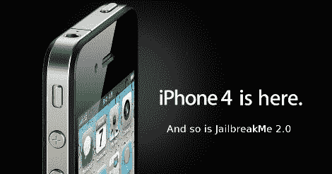

# 越狱你的苹果产品

> 原文：<https://hackaday.com/2010/08/02/jailbreak-your-apple-products/>

[终于来了](http://blog.iphone-dev.org/post/890709355/the-return-of-jailbreakme-com)，在被宣布完全[合法越狱](http://hackaday.com/2010/07/28/extra-extra-now-legal-to-jailbreak-iphone/)你的 iPhone 之后， [JailbreakMe 2.0](http://www.jailbreakme.com) 发布。

现在，只要访问上面的网址，任何 iDevices 都可以越狱；然而，在你开始你在未经老大哥苹果批准的应用程序领域的曲折冒险之前，有几个问题。

网页正在关闭，所以你必须等待。有可能[越狱不会成功](http://www.engadget.com/2010/08/01/official-iphone-4-jailbreak-hits-from-iphone-dev-team/)，你可能会损坏你的手机。越狱后，彩信和 Facetime 出现了并发症。最后，仍然需要使用 ultrasn0w 来解锁载体。

但除了那些小小的垫脚石，越狱也只是一触即发。