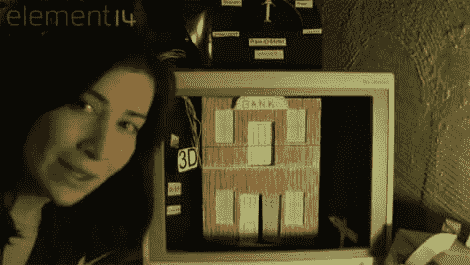

# 杰里·埃尔斯沃斯射击馆

> 原文：<https://hackaday.com/2011/05/09/jeri-ellsworths-shooting-gallery/>

回到另一个有趣的视频，[Jeri Ellsworth]再次为我们带来了一个既有趣又有教育意义的视频。这一次，她制作了一个“射击馆”,采用了老式街机游戏的风格，实际上使用了抛射物。然而，在她的版本中，她在被枪探测到的目标中使用发光二极管。为了保持这种感觉，她在适当的时候给丁装了一个弹球铃，效果很好。

像往常一样，她做了一个伟大的工作，打破一切，并解释这一切是如何运作的。她向我们展示了她的原型，这样你就可以看到它是如何构造的，如果你能在开始时通过焊枪枪战。如果她在功能原型阶段之后继续这个项目，我们很乐意看到为目标 [pepper 的幽灵](http://en.wikipedia.org/wiki/Pepper%27s_ghost)风格展示的小视频剪辑。也许我们只是对[时间旅行者](http://en.wikipedia.org/wiki/Time_Traveler_%28video_game%29)有着美好的回忆。