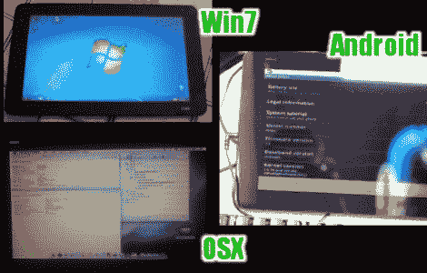

# Joojoo 替代操作系统安装

> 原文：<https://hackaday.com/2010/06/16/joojoo-alternative-os-installations/>

随着非粉丝们开始接触 iPad 替代品，Joojoo 的黑客们也开始涌入。该设备的[定制操作系统论坛](http://www.thejoojooforum.com/viewforum.php?f=7)讲述了成功安装 [Windows 7](http://www.thejoojooforum.com/viewtopic.php?f=7&t=191) 、 [OSX](http://www.thejoojooforum.com/viewtopic.php?f=7&t=189) 、 [Android](http://www.thejoojooforum.com/viewtopic.php?f=7&t=209) 和 [Jolicloud](http://www.thejoojooforum.com/viewtopic.php?f=7&t=213) 的故事。

到目前为止，唯一有操作指南的是 Windows 7，但我们确信这种情况会很快改变。当微软的产品安装在设备上时，每次充电可以使用大约四个小时，这相当不错。我们很想得到一台，并在 Android 上试用，但 499 美元的价格对我们来说仍然是一个障碍。我们不是说它定价过高，因为[它在引擎盖下有很多](http://hackaday.com/2010/04/04/joojoo-turns-out-to-be-legit-gets-torn-down/)。即使是这个价格，我们也认为它能让 T4 的 aPad T5 大放异彩。

[谢谢安迪]