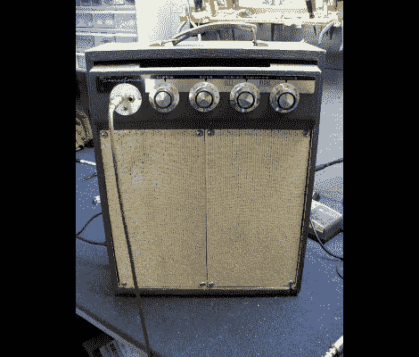

# 垃圾场电子管放大器黄金！

> 原文：<https://hackaday.com/2011/11/21/junkyard-tube-amp-gold/>

为什么，哦，为什么，哦，为什么人们会扔掉那些超棒的复古硬件？？幸运的是，[迪诺]在正确的时间亲自去了废品站。尽管你不应该拿别人掉的东西，但他偷走了放在那里的复古便携式转盘。他把它打开，想出了如何把它变成这个巨大的电子管吉他放大器，而不需要那么多麻烦。

原来的转盘曾经是上图中前格栅的位置。吉他放大器的版本坐在最后的情况下，这是完美的工作，因为携带处理现在在顶部。这个方向会把放大器硬件颠倒过来，所以[Dino]把它拉出来，翻转过来。唱盘的扬声器分开放置，用电线连接。但它们也是这个单元的盖子。这使得它们的尺寸非常适合并排放在转盘留下的空间里。

[Dino]在休息之后用他的新硬件为构建视频录制他自己的音乐。听起来很棒，看起来也很棒，而且它没有被不必要的埋在地下。太棒了。

[https://www.youtube.com/embed/YvBX_tq5VPs?version=3&rel=1&showsearch=0&showinfo=1&iv_load_policy=1&fs=1&hl=en-US&autohide=2&wmode=transparent](https://www.youtube.com/embed/YvBX_tq5VPs?version=3&rel=1&showsearch=0&showinfo=1&iv_load_policy=1&fs=1&hl=en-US&autohide=2&wmode=transparent)