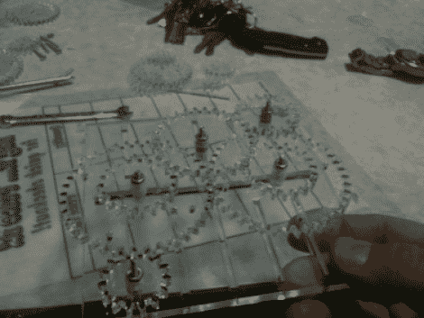

# 以防你不知道激光切割机有多棒

> 原文：<https://hackaday.com/2012/01/16/just-in-case-you-didnt-know-how-awesome-laser-cutters-really-are/>

[Alex]用最简单的方法得到了一台 Epiloge 激光切割机——他工作的公司买了一台。我们确信他不是想揭疮疤，但他真的让这个工具看起来和听起来都很酷，在他纯粹为了炫耀新的~~玩具~~硬件而写的帖子中。

这个型号是 CO2 激光器，它能够蚀刻和切割各种材料。它的分辨率为 1200 DPI，间距为 0.005。雕刻文本和图像的样本显示了这种精度可以实现的清晰线条和形状。最令人震惊的例子是一块阳极氧化铝，最终显示出一些奇妙的对比，这将成为项目外壳的完美面板。然后是切割功能，负责上面看到的齿轮演示。我们很惊讶地听说，它可以切割丙烯酸，但不能切割聚碳酸酯。

休息之后，我们嵌入了[亚历克斯的]视频。当切割机雕刻一些文字时，摄像机聚焦在切割机上，然后切割出一个齿轮。在这个过程中，他讨论了他对这款设备的了解，分享了一些有趣的趣闻。

我们希望能从[Grenadier] [那里看到一些很酷的东西，他最近获得了](http://hackaday.com/2012/01/13/grenadier-wins-the-laser-cutter-for-his-portable-x-ray-project/)一个类似的全光谱 40 瓦 CO2 激光器。

[https://www.youtube.com/embed/ZPw2_HtFFvQ?version=3&rel=1&showsearch=0&showinfo=1&iv_load_policy=1&fs=1&hl=en-US&autohide=2&wmode=transparent](https://www.youtube.com/embed/ZPw2_HtFFvQ?version=3&rel=1&showsearch=0&showinfo=1&iv_load_policy=1&fs=1&hl=en-US&autohide=2&wmode=transparent)