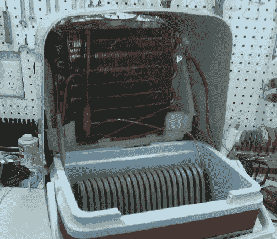

# 保持啤酒从桶到龙头都是冰镇的

> 原文：<https://hackaday.com/2011/03/28/keeping-beer-chilled-from-keg-to-tap/>

[Stan]正在组装他的纳米啤酒厂，在等待他的啤酒发酵完成时，他决定着手他项目的储存部分。他建造了一个啤酒桶来储存即将到来的啤酒，但他意识到，由于啤酒桶距离他的龙头塔大约 10 英尺，啤酒在运输过程中变得不可接受地温暖和起泡。

在商业龙头系统中，单独的冷冻丙二醇管线与啤酒管线捆绑在一起，在啤酒从桶到龙头的过程中保持其凉爽。[【Stan】决定复制这个设置](http://stan.theblossers.net/2011/03/diy-glycol-power-pack-for-beer-line.html)，经过三次不同的迭代，他搞定了。

他的前两次尝试涉及将冷却溶液保持在 kegerator 内，但他发现要么泵给溶液增加了过多的热量，要么 kegerator 以接近 100%的占空比运行。他放弃了任何一种基于 kegerator 的冷却方式，决定用他放在身边的除湿机建造一个独立的冷却装置。在将该装置安装到冷却器中并装满溶液后，他发现它冷却得如此之好，以至于将丙二醇溶液变成了雪泥！

查看他的网站，了解更多关于他的冷却设置的细节——如果你从事家酿啤酒的生意，你会很高兴你做了。