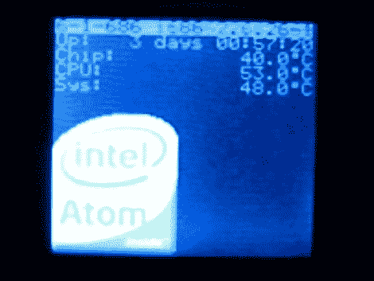

# 作为 Dockstar 屏幕的钥匙链 LCD

> 原文：<https://hackaday.com/2010/11/19/key-chain-lcd-as-screen-for-a-dockstar/>

彼得·冈恩在他的船坞之星上增加了一个液晶显示屏。现在我们想到了，这真的不应该很难，因为 Dockstar 可以运行 Linux 内核，它有 USB 端口。[Peter]从[Sprite _ TM]的钥匙链 LCD4Linux hack 中获得灵感，我们在许多个月前看过这个[。他用了一个便宜的克比 DP182 数码相框，不到 5 美元就可以买到。稍微修改一下固件，LCD4Linux 就可以通过 USB 将图像传输到设备上。[Peter 的]设置以每秒一帧的速度刷新屏幕，但如果你需要的只是来自](http://forum.doozan.com/read.php?2,2435,2435,quote=1http://hackaday.com/2008/01/11/friday-night-double-cap-extra/)[的一点反馈，否则无头系统](http://hackaday.com/2010/10/04/more-openwrt-image-building-for-the-dockstar/)这是一个伟大的解决方案。

[谢谢米卡]