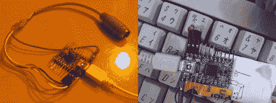

# 键盘转换器 2 件装

> 原文：<https://hackaday.com/2011/03/10/keyboard-converter-2-pack/>

[复仇]指出了 geekhack fourms 上的几个很酷的小项目帖子，这些帖子将老式键盘转换为 USB。它们都支持 VUSB，因此理论上可以使用任何符合 VUSB 要求的 avr 微控制器。

首先是一个 [PS/2 到 USB 键盘转换器](http://geekhack.org/showwiki.php?title=Island:14618)，虽然这之前已经做了很多次，但这一个有一些不常见的额外功能，如鼠标键，系统和多媒体键，以及键图定制。还通过 VUSB 库提供了使用非 USB 使能 avr 控制器(如 mega 168 或 328)的说明(尽管并非所有功能都可用)。

Next 几乎是同样的东西，但它将[苹果桌面总线转换为 USB](http://geekhack.org/showwiki.php?title=Island:14290) ，这并不罕见，但它缺乏时钟串行信号，有点可变的时序，以及你在旧货店找不到一桶苹果键盘的事实，使得任何 ADB 转换器都值得一提。

VUSB 指令似乎对两者都一样，来源是可用的，并且列出了一些很酷的图片和信息，除此之外，还有什么比能够将你的 [Model M](http://en.wikipedia.org/wiki/Model_M_keyboard) 插入你的上网本，或者将你的 [Apple Extended Keyboard](http://en.wikipedia.org/wiki/Apple_Extended_Keyboard) 插入你的 mac mini 更有趣的呢？