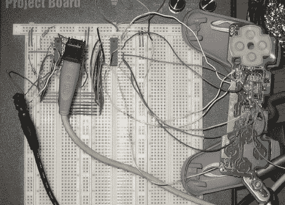

# PlayStation 的键盘输入

> 原文：<https://hackaday.com/2010/05/20/keyboard-input-for-playstation/>

任何尝试过 RPG Maker 1(或任何带控制器的文本输入)的人都知道在控制台中键入长段落有多困难。[Thutmose]在这里用 [Kupid 1.0](http://thutmosesworkshop.com/blog/?page_id=196) (生产中的 2.0)化险为夷。PICAXE 接受 ps/2 键盘输入，并将其转换为 PS1 和 PS2 控制器的一系列 d-pad 按钮按压，与之前单调的任务相比，提供了[快速数据输入](http://www.ustream.tv/channel/kupid-testing)。

我们很高兴地得知[源代码和硬件](http://thutmosesworkshop.com/blog/?page_id=270)已经发布，这意味着它有可能很容易适应任何控制器/控制台。