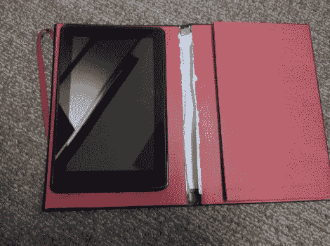

# 一本 Moleskine 杂志的 Kindle Fire 封面

> 原文：<https://hackaday.com/2011/12/12/kindle-fire-cover-from-a-moleskine-journal/>

[Kevin Haw]自豪地拥有一台全新的 Kindle Fire。但是为了保护投资，他想要一个好看的盒子，并决定自己动手做。他最终将一本 Moleskine 杂志重新用作了一个桌面封面。

你可以在一个小时内自己完成这个。这些日志的大部分页面都是缝合好的，凯文开始用业余爱好刀剪断线绳。一旦取下，他就用美工刀把粘在封面上的书页分开；这使你处于上面看到的状态。

显然这种未完成的外观是不行的。[凯文]用一些红色胶带胶带来掩盖难看的脊柱。这增加了强度，并做了清理该区域的工作，但我们也可以在整个内部区域应用毛毡(或超细纤维布)来获得更多的外观。最后一部分是安装平板电脑，这是用 Velcro 胶带完成的。如果你决定使用不同的外壳，这些可以在以后从 Kindle Fire 的背面移除。