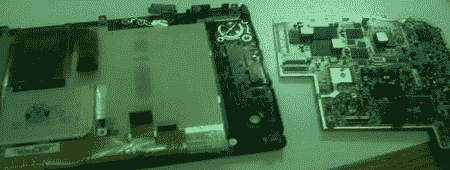

# Kindle 屏幕移植

> 原文：<https://hackaday.com/2008/08/22/kindle-screen-transplant/>

【Blake bevin】的姐姐打碎了他[亚马逊 Kindle](http://www.mahalo.com/Kindle) 的屏幕，所以他决定尝试[用索尼阅读器的屏幕](http://www.instructables.com/id/Amazon_Kindle_e_ink_Screen_Transplant_from_a_Sony_/)替换它。他拆卸了索尼阅读器，用一个 Dremel 磨掉了 E Ink 屏幕上的大部分铝标签。该屏幕与原始 Kindle 屏幕插入相同的线束，唯一的问题是配合。新的屏幕会干扰一些按钮的移动，如果不修剪的话，外壳会有点凸出。性能方面，翻页时屏幕出现重影，[blakebevin]认为这是由于旧技术造成的。我们希望永远不要这样做，但很高兴知道移植的选择是存在的，而且不是很困难。

*   [永久链接](http://www.instructables.com/id/Amazon_Kindle_e_ink_Screen_Transplant_from_a_Sony_/)