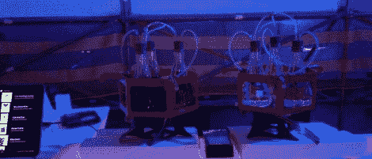

# 厨房黑客:机器人调酒师

> 原文：<https://hackaday.com/2011/11/17/kitchen-hacks-an-android-bartender/>

[Nick]刚刚完成 bis barbot build，它是以我们最喜欢的酒保 T2 的名字命名的。这是一个令人印象深刻的能力，即使它是廉价的。

用户通过 Android 平板电脑为 iZac 选择一款酒。这种饮料被一个机器人 ADK 解释为让机器人的机械装置开始工作并开始制作饮料。

移动液体的部分受到邪恶的疯狂科学家实验室的[饮料制作单元 2.0](http://hackaday.com/2011/04/04/class-up-your-next-party-with-the-drink-making-unit-2-0/) 的启发。[Nick]将一个水族箱气泵连接到一个锥形烧瓶上，而不是用泵通过管道抽取液体。由于气压不同，虹吸管把液体从烧瓶中抽出来。液体由他设计的几个[激光切割夹管阀](http://www.thingiverse.com/thing:12311)控制。

一旦用户选择了一种鸡尾酒，机器人就会开始行动，将液体分配到位于称重传感器上的玻璃杯中。因为玻璃杯一直在称重，所以 iZac 准确地知道鸡尾酒中的酒精含量(以及比例)。[Nick]在悉尼 hacker space 用苏打水和调味料测试了 iZac。事实证明，iZac 非常受欢迎，我们想知道我们是否可以在酒柜中建造这样的东西。