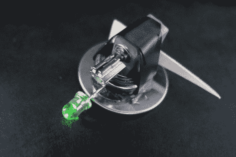

# Klackerlaken 让普通人对电子产品感到兴奋

> 原文：<https://hackaday.com/2012/03/01/klackerlaken-gets-the-common-man-excited-about-electronics/>

Klackerlaken 是 LED throwie 和 bristlebot 的组合。这个小玩意很容易制造，除了取悦大众之外，真的没有别的目的。这种小型设备第一次出现在野外是在 2011 年 CCC(混沌通信营)的一次实践研讨会上。休息后看看这个片段，你就会明白为什么观众会被吸引。

我们之前已经见过大量的刚毛机器人(这款[微型可操纵版本](http://hackaday.com/2011/09/15/steerable-bristlebot-via-ir-control/)是我们的最爱之一)，并且很好奇看到瓶盖被用作脚而不是传统的牙刷头。事实上，该视频剪辑展示了几个不同的迭代，包括两个帽作为纽扣电池和振动电机的外壳。顶部的眼睛看起来更完整。

用发光二极管、假眼、尾巴和羽毛装饰机器人有助于锻炼孩子们在组装自己的机器人时学习的技术方面。我们很高兴[Martin]分享了顶部的链接，该链接涵盖了在 Dorkbot Berlin 举办的研讨会上看到的创作。这将是你的黑客空间的下一次开放日的一个很好的活动！也许有可能在设计上有所改进的后续课程，使用可充电电池代替一次性按钮，或者超级电容可能会起作用。

【维梅奥 http://vimeo.com/27589074 w = 470】