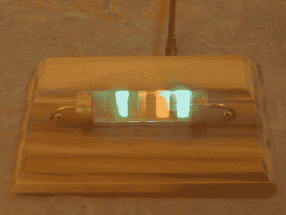

# 了解你的电阻…告诉时间

> 原文：<https://hackaday.com/2010/01/15/know-your-resistors-tell-the-time/>

[达伦]造了一个用电阻显示时间的时钟。它实际上使用了一个电阻模型。在[黑客日设计挑战赛](http://hackaday.com/2006/11/15/hackaday-design-challenge-yes-a-contest/)中，这个极其拖沓的参赛作品将所有的电子元件都放在一个名片大小的 PCB 上。四个 RGB 发光二极管通过木制底座上的孔照亮丙烯酸管上的光带。颜色对应于[电阻器颜色代码](http://en.wikipedia.org/wiki/Resistor_color_code)中使用的值。在上面的图片中，时钟显示 5:26(这应该是一个红色的带，但相机没有很好地捕捉到它)。中间的条带在 60 秒内逐渐变大，表示上午，逐渐变小，表示下午。

可能有点晚，但这是个巧妙的设计。它看起来很时尚，界面上没有按钮。【Darren】将[led 本身作为光传感器](http://hackaday.com/2006/02/21/low-cost-sensing-and-communication-with-an-led/)来显示日期，并进入时间设置模式。