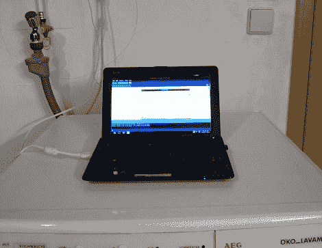

# 局域网连接的洗衣机让你知道你的衣服什么时候洗好

> 原文：<https://hackaday.com/2011/08/05/lan-connected-washing-machine-lets-you-know-when-your-clothes-are-done/>

洗衣机配备了一个相当不准确的计时器，所以总是很难估计什么时候才能洗完。因为它位于他的地下室，他讨厌不断地检查机器，以了解他的衣服什么时候洗好。与其一遍又一遍地在楼梯上爬上爬下，他决定黑进一个自己的“周期结束”通知程序。

洗衣机有一个 LED，当它最终完成任务时会发光，所以[Micha]拆下 LED 并焊接两根电线，然后连接到他的 Arduino。当洗衣机完成时，LED 应该会亮起，Arduino 会检测到输入已被拉低，发出循环结束的信号。Arduino 通过以太网屏蔽连接到他的家庭网络，使他能够从最近的网络浏览器舒适地监控过程。

这是一个聪明的实现，它确实节省了他许多上下楼梯的时间。干得好！