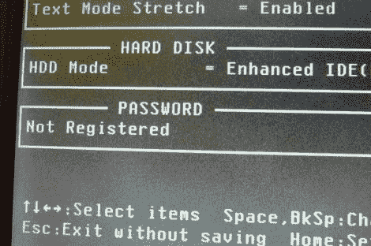

# 使用简单的加密狗恢复笔记本电脑 BIOS 密码

> 原文：<https://hackaday.com/2011/03/08/laptop-bios-password-recovery-using-a-simple-dongle/>

在他的工作中，Instructables 用户[Harrymatic]看到许多东芝笔记本电脑出现在他的办公桌上，其中一些有 BIOS 密码保护。通常，为了通过 BIOS 锁定并访问计算机，他必须打开笔记本电脑外壳，短接 CMOS 复位引脚或拔出 CMOS 电池。这个过程相当繁琐，所以他更喜欢用一个更简单的方法，[一个并联回环插头](http://www.instructables.com/id/Toshiba-Laptop-BIOS-Reset-Dongle)。

这个插件本身很容易构建。按照他的教程中所示的排列方式，将一些电线焊接到标准公 D-sub 25 连接器的背面后，他就可以开始工作了。当笔记本电脑接通电源并插入插头时，BIOS 密码被清除，计算机可以正常使用。

应该说，他只是肯定这适用于他在文章中列出的特定东芝笔记本电脑型号。看到其他笔记本电脑品牌也尝试这样做，看看他们是否会以同样的方式做出回应，这将是一件有趣的事情。由于现在没有生产带并行端口的笔记本电脑，你有一些找回笔记本电脑 BIOS 密码的技巧或窍门吗？请务必在评论中与我们分享。