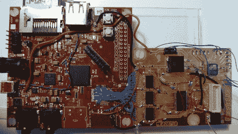

# 在 Beagleboard 项目中重新使用笔记本电脑 LCD

> 原文：<https://hackaday.com/2011/02/07/laptop-lcd-reused-in-beagleboard-project/>

这个子板让[Matt Evans] [用一个猎兔犬板](http://axio.ms/projects/beaglelcd/)驱动一个笔记本电脑的液晶显示器。显然，Beagleboard 在升级到 C 版时获得了 VGA 接口，但[Matt]使用的是 B4 版，这就是为什么他必须用蓝线进行忍者焊接。驱动板本身是一个美丽的东西，托管 DS90C363 [LVDS](http://en.wikipedia.org/wiki/Low-voltage_differential_signaling) 串行器以及一些处理电平转换的缓冲芯片。他还包括一个 ATmega48，以便他有一些未来改进的选项。

LCD 安装在定制的丙烯酸外壳中，背面贴有 Beagleboard 和 driver board。有 RS232 和 USB 集线器，这使得使用 WiFi 加密狗进行通信成为可能。到目前为止，除了在屏幕上显示图像之外，他没有太多的功能，但有一些关于使用触摸板进行控制的说法。我们希望看到一个触摸屏覆盖，将构建转化为一个合适的基于 ARM 的平板电脑。