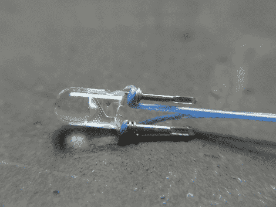
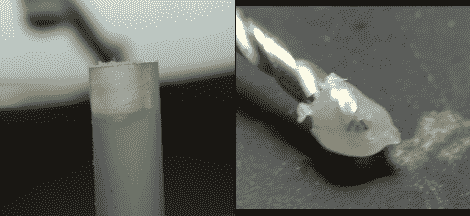
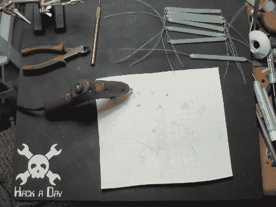
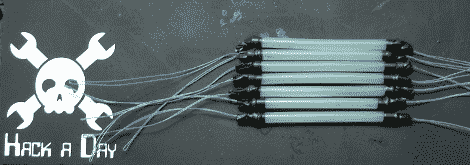
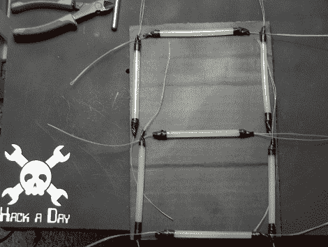
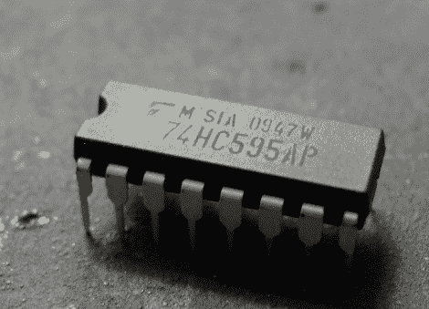
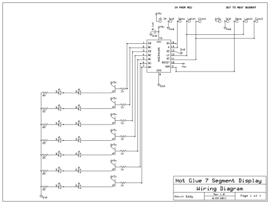
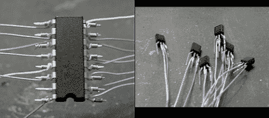
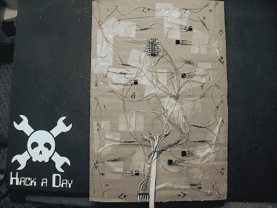

# 由胶水制成的 7 段大显示屏

> 原文：<https://hackaday.com/2011/08/25/large-7-segment-display-made-from-glue/>

我们在 Hack A Day 喜欢 LED，以及所有与 LED 相关的东西，但 LED 最大的问题之一是尺寸小。我们想要更大更亮，像电视一样大的矩阵，像墙一样大的七个分段，像棒球一样大的单个白色 led，比太阳还要亮！

我最近被委托制作一个使用大量数字显示的设备，我出去购物。我们最喜欢的七段仍然相当昂贵，无论如何也不适合我们的外壳。我们最终走了一条不同的路线，但这真的让我思考…如果你想做一个有相当大显示屏的东西呢？一个人怎么能在家便宜地做这件事呢？

我首先想到的丙烯酸棒，但我附近没有人有任何小直径，或在一个体面的价格。没关系，我手头上没有那么多工具，我只能看到我试图用手电钻钻出一根细塑料杆的末端，我的膝盖就像一个夹子。环顾总部，我找到了我藏的胶棒。我认为这会是一个有趣的展示，而且很容易操作。

在我知道之前，我已经有了一个 9 英寸高、6 英寸宽、7 段的显示器。我将第一个承认，它在质量或亮度上并不引人注目，尽管显示器本身只花了 4 美元的材料。一个快速简单的项目，特别是如果你需要一个快速记分板或大时钟。

休息后加入我们，看看显示器和控制器电路是如何制作的。

**物资:**

14 个发光二极管，在不产生热量的情况下尽可能亮。我用的是 3 毫米琥珀色 LED 灯，每个 30 毫安，非常亮。胶棒会吸收大量的光，这是个缺点。

7 根热熔胶棒，足够大，可以将 led 粘在两端，指向中间。你还会用到很多热熔胶，所以要多留一些。

7 个 NPN 晶体管，我用的是 2222 的

7 个 1k 欧姆电阻

7 个 22 欧姆的电阻，这是给我的 led 用的，让 30 毫安的电流通过两个串联的 LED，[使用在线 LED 计算器](http://led.linear1.org/led.wiz)来获得你的 LED 的正确值

1 个 74HC595 移位寄存器

电工胶带

封口胶纸

用来安装显示器的东西。在我的情况下，一些快速画纸板。

细线(很多)

穿孔电路板

焊料

**工具:**

烙铁

热胶枪

绕线工具(使生活更简单，但不是必需的)

剪钳

援助之手

多功能小刀

锥子(打孔的工具)

标记

**显示:**

在我看来，最乏味的部分是接线的 LED 的。我将一圈绕线连接到每个 LED 的每根引线上，并进行焊接。wirewrap 工具使这一过程变得简单，但是如果您没有，也不用担心。只需从带状电缆中取出一些电线，从末端剥去一点，在电线末端涂上一些焊料，然后将少量焊料粘在元件引线上。

一旦两端镀锡，就只需将两端熔在一起。我发现使用镊子真的很有帮助。你希望每根 LED 引线有大约 4-5 英寸长的电线。这将会给你足够的时间来工作。一旦你把 28 根电线焊接到 14 个发光二极管上，你就可以暂时把它们放在一边，开始加热胶枪。




我希望发光二极管在胶棒的每一端指向中间。最初，我想我可以用一个钻头，用手在胶棒的末端钻一个小孔。这在最初的几个孔中非常有效，但是没过多久，钻头的熔化作用就超过了切削作用。我还学到了冷冻胶棒，即使是一点点，也会使它变得非常脆。



我终于明白了，我是在用胶棒工作，使用胶枪的喷嘴来制作草皮会更容易，然后在胶水凝固之前迅速掩埋 LED。当使用热熔胶喷嘴时，你不需要走得太远，否则它可能会吹掉你试图使用的胶棒的一面。如果你真的搞砸了，那只是胶棒，用热胶水很容易就能搞定。我设法用一种特殊的方式把每一个都弄乱了，结果都差不多。



在棍子冷却下来后，我用电工胶带包裹末端，这有几个作用:首先，它可以防止光从末端泄漏出来，其次，它包裹在 LED 的周围，以防止每个末端都有亮点，第三，它帮助我均匀可见的分段部分。在你把所有的 led 灯管粘好之后，测试每一个 LED 是一个好主意，以确保你不会在缠绕胶带的时候不小心弄断电线或者短路。我用一个 9 伏的电池和一个 500 欧姆的电阻与 LED 串联来快速测试。



现在所有的片段都准备好了，我把它们放在纸板上，在胶棒的每一端做上标记，在电线伸出的地方做上标记。然后我用锥子在纸板上打孔，这样电线就可以穿过去了。最后，我用热胶水将每一段安装在适当的位置，并在背面每根电线穿过的地方涂上少量胶水。



剩下的工作就是给 LED 和它们的限流电阻接线。胶棒的每一侧相互串联。电流流入一个 LED 的阳极，从阴极流出，流入第二个 LED 的阳极，从阴极流出，通过电阻接地。(是的，我知道这是反过来的，但它更容易解释)为了做到这一点，我抓住我的 9 伏和电阻器，并找到了两个 LED 的阳极和阴极在一段，扭转适当的导线连接在一起，并焊接。

我将限流电阻焊接到 LED 串联对的负极，并在完成后用一点透明胶带压住电线。从这里开始，你应该能够连接每个片段并控制显示。但这意味着你需要 7 根引线连接到你的微控制器，如果你想要另一个显示器，那就多 7 根引线。为了使这个东西容易控制和容易扩展，我会添加一些简单的电路。

**制作控制器:**



电路的核心是 74HC595 串行到并行移位寄存器。这个方便的小设备让我们用总共 5 根线来控制显示器，我们可以在不增加线数的情况下链接任意多的显示器。移位寄存器是很容易操作的设备，在 595 的情况下，你必须担心三件事。

存储或闩锁:

74HC595 包含一个称为存储寄存器的额外寄存器。这个特性意味着你可以等到所有的位都混进来之后再让它们输出，也意味着一旦输出在存储器中，你不必再更新它，直到你需要改变它。在发送数据之前，必须降低(接地)存储时钟或锁存引脚。一旦你完成发送数据，然后提高(+5v)设置存储寄存器和显示输出。

串行数据:

通过这个输入，你将从微控制器向移位寄存器一次发送一位数据。让您的 MCU 将一个引脚设为高电平或低电平，然后切换串行时钟。

串行时钟:

一旦您的位被置位，此输入上从低到高的转换将数据发送到移位寄存器。

当数据串行输入时，它通过一连串的触发器电路发送，除了其他用途外，它还形成了一个基本的存储器。74HC595 是一款 8 位器件，因此，如果您降低锁存器，向其串行发送 8 位，然后升高锁存器，您将在芯片输出上同时看到所有 8 位。这将串行数据转换为并行数据。

我们必须记住移位寄存器的绝对最大值。通常，这种芯片可以让你通过每个输出引脚约 20 毫安，这听起来很适合驱动 LED。但问题是，在超出规格之前，整个设备只能处理大约 70 毫安的电流。我的每个部分都将消耗大约 30 毫安的电流。虽然这些芯片可以忍受一些滥用，但这是不合规格的。

要处理 LED 所需的电流，您可以使用合适的 LED 驱动器/接收器。外面有很多，但我一个也没有。我确实有一堆晶体管，可以处理 10 倍的电流，甚至更高，没有任何问题。这种设置是晶体管作为开关的一个不合适的版本，但将为一个小显示器工作，并节省了令人头痛的反转数据。更重要的是，它将让我的移位寄存器用一小部分电流来控制每一段，而晶体管则完成繁重的工作。

[](http://hackaday.com/wp-content/uploads/2011/08/gluestick.png)

(点击查看大图)

从这里开始，所有的东西都需要连接起来。这可以很容易地在一块穿孔电路板上完成。如果你和我一样，或者刚从 perfboard 出来，最近的无线电小屋也有一个小时的路程，而且你已经把电线包好了…那么你可以“死虫”并焊接它。组件被固定到位，连接用热熔胶和胶带绝缘。





为了让显示器与您的 MCU 通信，我使用了一段 5 芯带状电缆。电线按以下顺序排列。+5、接地、数据、锁存器、时钟。为了让显示器连接到另一个显示器，我用+5、接地、数据、锁存器和时钟连接了一个小接头，但数据不再来自 MCU。它现在由移位寄存器的引脚 9 发送。由于移位寄存器是 8 位，如果我以这种方式链接其中的 2 位，那么我可以发送 16 位数据，其中 8 位将从引脚 9 上的第一个寄存器“溢出”，并进入第二个、第三个或第四个寄存器的输入。

由于 74HC595 是最受欢迎的移位寄存器之一，您将能够找到您正在使用的任何微控制器的附加文档。我碰巧像往常一样买了我的 arduino，所以我就做了一些简单的使用移出功能的复制粘贴软件。

```

// hot glue seven segment display test

// define pins used
#define dataPin 2
#define latchPin 3
#define clockPin 4

// define light patterns
byte one = B01100000;
byte two = B11011010;
byte three = B11110010;
byte four = B11100100;
byte five = B10110110;
byte six = B10111110;
byte seven = B01100010;
byte eight = B11111110;
byte nine = B11100110;
byte zero = B01111110;

void setup()
{
	pinMode(dataPin, OUTPUT);
	pinMode(latchPin, OUTPUT);
	pinMode(clockPin, OUTPUT);
}

void loop()
{
	digitalWrite(latchPin, LOW);
	shiftOut(dataPin, clockPin, MSBFIRST, one);
	digitalWrite(latchPin, HIGH);
	delay(2000);
	digitalWrite(latchPin, LOW);
	shiftOut(dataPin, clockPin, MSBFIRST, two);
	digitalWrite(latchPin, HIGH);
	delay(2000);
	digitalWrite(latchPin, LOW);
	shiftOut(dataPin, clockPin, MSBFIRST, three);
	digitalWrite(latchPin, HIGH);
	delay(2000);
	digitalWrite(latchPin, LOW);
	shiftOut(dataPin, clockPin, MSBFIRST, four);
	digitalWrite(latchPin, HIGH);
	delay(2000);
	digitalWrite(latchPin, LOW);
	shiftOut(dataPin, clockPin, MSBFIRST, five);
	digitalWrite(latchPin, HIGH);
	delay(2000);
	digitalWrite(latchPin, LOW);
	shiftOut(dataPin, clockPin, MSBFIRST, six);
	digitalWrite(latchPin, HIGH);
	delay(2000);
	digitalWrite(latchPin, LOW);
	shiftOut(dataPin, clockPin, MSBFIRST, seven);
	digitalWrite(latchPin, HIGH);
	delay(2000);
	digitalWrite(latchPin, LOW);
	shiftOut(dataPin, clockPin, MSBFIRST, eight);
	digitalWrite(latchPin, HIGH);
	delay(2000);
	digitalWrite(latchPin, LOW);
	shiftOut(dataPin, clockPin, MSBFIRST, nine);
	digitalWrite(latchPin, HIGH);
	delay(2000);
	digitalWrite(latchPin, LOW);
	shiftOut(dataPin, clockPin, MSBFIRST, zero);
	digitalWrite(latchPin, HIGH);
	delay(2000);
}

```

我定义了一组字节，每一位都是开(1)或关(0)的一段。因为我们只使用了 8 位中的 7 位，所以位 0 总是为 0，尽管这可能是小数点或其他数字。当我连接这些段时，我从顶部开始，将其连接到移位寄存器输出的位 1，并以顺时针方向运动，将位 7 作为中间段。当然，当我翻转显示器时，我很快注意到我实际上是逆时针接线的(哎呀)。这并不重要，你只需要知道哪一段连接到每一位。

在设置功能中，我只是让我的微控制器引脚作为输出

在循环函数 I 中:

放下门闩

使用移出向移位寄存器发送 1 个字节(8 位数据)

抬起插销查看结果

暂停 2 秒钟，转到下一个号码

这就对了。一个由胶棒制成的巨型 7 段显示器，易于控制，易于链接，虽然不是有史以来最棒的东西，但我希望它能激励你未来的项目。

[https://www.youtube.com/embed/ZIWa28KRmW4?version=3&rel=1&showsearch=0&showinfo=1&iv_load_policy=1&fs=1&hl=en-US&autohide=2&wmode=transparent](https://www.youtube.com/embed/ZIWa28KRmW4?version=3&rel=1&showsearch=0&showinfo=1&iv_load_policy=1&fs=1&hl=en-US&autohide=2&wmode=transparent)