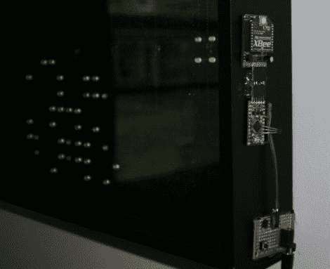

# 大型遥控生活游戏展示

> 原文：<https://hackaday.com/2011/05/03/large-remote-controlled-game-of-life-display/>

有时候过度设计只是单纯的乐趣。[Stephanie]当她成功地为一个项目添加了比她真正需要的多得多的电子元件时，会有一种温暖模糊的感觉——只是因为她可以。如果这是她想要的目标，我们真的不能和她争论，我们也不能对她组织的甜蜜的生活游戏挑毛病。

她从 Adafruit 的六个生命游戏[套件开始，但她很快发现了 LED 的问题，她的收藏增加到 20 个套件(如果你还记得的话，那就是 320 个 LED)。将它们拼在一起后，它们被装在一个木框里，放在一块深色的丙烯酸树脂后面。它看起来很棒，工作也很好，但对她的口味来说还不够。](http://www.ladyada.net/make/conway/)

最后，她在生活游戏显示器中添加了一个小 Arduino 和 Xbee 模块，这使得它可以由我们几周前推出的网络恒温器控制。恒温器还安装了一个 Xbee 单元，允许它在[斯蒂芬妮]指定的任何时间开启和关闭生活游戏。

我们要两份。

[via [Adafruit 博客](http://www.adafruit.com/blog/2011/05/02/nice-game-of-life-array/)