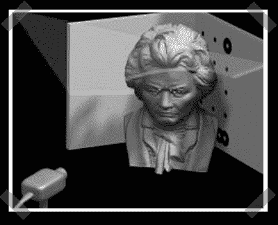

# 带网络摄像头的激光 3d 扫描

> 原文：<https://hackaday.com/2006/12/21/laser-3d-scanning-with-a-webcam/>

【Jan】注意到他们在机器人和过程控制研究所提出了一种有趣的低成本 3d [扫描](http://www.cs.tu-bs.de/rob/david.html)(更新:[http://www.david-laserscanner.com/wiki](http://www.david-laserscanner.com/wiki))的方法。一旦[软件](http://www.rob.cs.tu-bs.de/iRP_Download/index.php)与预设的背景图像校准，一条激光线就会在物体上运行(想想你见过的每一台科幻激光扫描仪)，软件似乎会在物体经过时通过线的中断来测量物体的轮廓。一旦进行了网格测量，就可以在软件中重建物体。根据[Jan]“凭借他们的技术，他们获得了今年柏林‘模式识别工作组’的主要奖项。”现在，让它在除了 windows 和. NET 之外的环境下工作。

获取您的[设计挑战](http://hackaday.com/category/contests/)参赛作品！25 号快到了！

*   [永久链接](http://www.cs.tu-bs.de/rob/david.html)