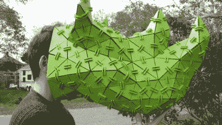

# 激光切割的 3D 雕塑让我们想起了旧的游戏机

> 原文：<https://hackaday.com/2011/10/24/laser-cut-3d-sculptures-remind-us-of-an-old-playstation/>

[Paul]又名[VoidFraction] [公布了他用激光切割多边形制作的](http://voidfraction.blogspot.com/2011/10/source-code-and-documentation.html)[雕塑](http://blog.makezine.com/archive/2011/04/laser-cut-polygonal-sculptures.html)的来源和文档。

为了计算他的三角形，[Paul]开发了 [LcAgl](http://voidfraction.blogspot.com/2011/10/lcalg.html) ，这是一种将 3D 模型转换为切割一大堆三角形和连接器所需的 AutoCAD 文件的算法。这个文件被拍摄到一个激光切割机，在一个令人困惑的组装后，[保罗]可以制作任何他想要的低多边形数模型。

对于他的雕塑，[保罗]使用 Coroplast，一种常用于政治竞选标志的波纹塑料。Coroplast 轻便灵活，是[Paul]将三角形组合在一起时的额外收获。连接片由丙烯酸制成，这是一种非常坚硬的材料，因此三角形被紧紧地固定在适当的位置。

由于大多数 3D 游戏中的模型只是一堆多边形，这种技术让我们想起了最初的 3D 主机游戏。[保罗]的犀牛看起来像是从一个低多边形游戏中走出来的，比如 [*虚拟战士*](http://www.youtube.com/watch?v=Z6Q9DGMXFEA) 或 [*跳跃闪光！*](http://www.youtube.com/watch?v=N2hukvZ0zBw) 。