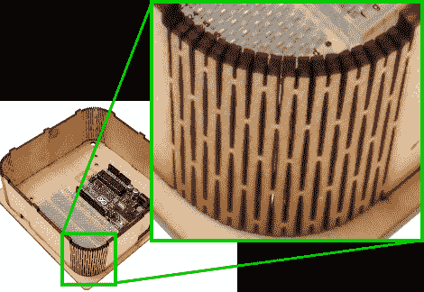

# 激光切割技术使胶合板可弯曲

> 原文：<https://hackaday.com/2011/12/07/laser-cutting-technique-makes-plywood-bendable/>

这里有一种激光切割技术[让薄胶合板变得可弯曲](http://oomlout.co.uk/?p=434)。通过从材料上切掉细长的钻石形状，留下了由交替的凸片最低限度连接的条带网格。木材是可弯曲的，而且它必须有些耐用，因为这个想法来自于一个使用这种技术的产品[一个铰链笔记本外壳](http://www.snijlab.nl/?page_id=358)。

我们对它作为一个经常使用的支点没有太多兴趣，因为它肯定是一个长期使用的问题。但是我们喜欢它的外观，就像上面看到的 Arduino 项目箱一样，它是一个圆形的角落。侧壁是一个连续的部件，具有相同的顶部和底部，用于容纳对准凸片。整个装置仅用四个螺栓/垫圈/螺母组合在一起。

但是如果你没有激光切割机，我们猜测你现在必须坚持[改变预制外壳](http://hackaday.com/2011/12/06/exterior-grade-electrical-box-as-project-enclosure/)。