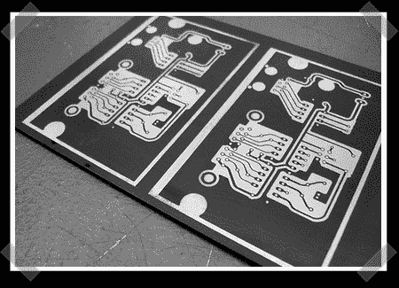

# 激光蚀刻印刷电路板

> 原文：<https://hackaday.com/2008/08/03/laser-etching-printed-circuit-boards/>

虽然我们希望你喜欢我们的[如何:蚀刻印刷电路板](http://www.hackaday.com/2008/07/28/how-to-etch-a-single-sided-pcb/)，墨粉转移肯定不是完成工作的唯一方法。来自 [macetech](http://macetech.com/) 的【Garrett】最近正在尝试使用 Epilog 激光蚀刻 PCB。他开始在铜板上涂一层薄薄的黑色喷漆。激光用于去除想要去除铜的区域的油漆。一旦完成，你像往常一样继续蚀刻。他最终[用丙酮去除了颜料蒙版](http://www.flickr.com/photos/macetech/2726870409/)。结果有非常精细、清晰的痕迹，但大多数尝试过这种方法的人都认为使用喷漆不够理想。

*   [永久链接](http://www.flickr.com/photos/macetech/2727694056/)