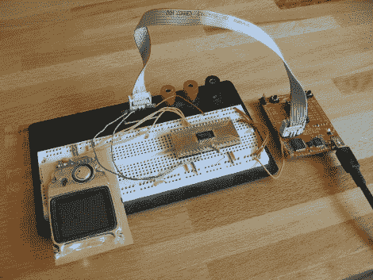
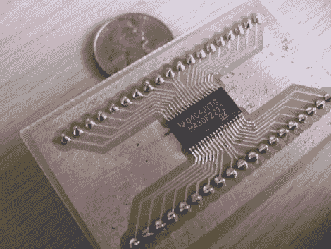

# Launchpad 不仅限于价值线芯片

> 原文：<https://hackaday.com/2010/09/28/launchpad-not-limited-to-value-line-chips/>

想要将我的 TI Launchpad 不仅仅用作开发板，我想我应该做一些实验，将它用作系统内程序员。经过几次失误后，我能够让它工作，然后更多。似乎该设备并不仅限于它打算支持的微控制器的价值线。在上图中，我用它来编写一个 [MSP430F2272](http://focus.ti.com/docs/prod/folders/print/msp430f2272.html) 的程序，这是一个非常强大的小芯片，有 32 KB 的程序空间。有关设置的更多信息，请点击休息。

我从蚀刻 38TSSOP 封装的分线板开始，这样我就有了一些可用的东西。[拖焊](http://hackaday.com/2010/08/29/hackaday-links-august-29-2010/)来救援，这比我预想的要容易。

一旦我接触到引脚，就只需要检查 Launchpad 板上使用的连接并连接 f2272。原来你只需要三个；特斯特、RST 和 GND。您可以从外部给电路供电，或者进行第四次电压连接。我很难过地看到，跳线头上没有 GND，所以除了使用 IDC 电缆，你可以在顶部的图像中看到，有一条橙色跳线从芯片插座连接到接地引脚分支。

但我还没完全掌握它。我很难可靠地连接到芯片并与之对话。在研究了原理图 (ZIP)之后，我意识到我被一个浮动的复位管脚所困扰。我抓了一个 4.7k 的电阻作为上拉电压，现在通信是完美的。对于我的测试代码，我正在使用诺基亚 3595 LCD 屏幕构建一个小版本的 pong。

为此，我使用 100%开源工具，这意味着我不局限于 2k 代码输出。您可以按照我们的 TI Linux 启动板教程为自己设置这些工具。