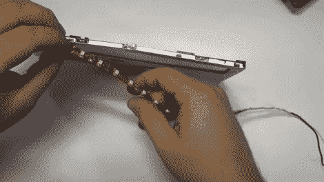

# LCD:用 led 取代 CCFL

> 原文：<https://hackaday.com/2011/05/31/lcd-replacing-ccfl-with-leds/>

有一天，他的数码相框的背光熄灭了。这些通常是冷阴极荧光灯，需要逆变器来提供正常工作所需的电压。当它们停止工作时，通常是逆变器的问题。由于该电路由非常小的表面贴装电路组成，他决定[用 led](http://filear.com/dnn/Home/tabid/41/EntryId/50/Repairing-broken-LCD-screen-backlight-with-LEDs.aspx)代替背光，而不是修理逆变器。

在休息后的视频中,[Fileark]将会浏览整个项目。在仔细查看了相框内部后，他估算了一下柔性基板上的一条发光二极管。承载液晶显示器的金属固定支架必须进行改造，以适应新的光源，为此，他在视频中加入了黑客蒙太奇。最终结果看起来很普通，他估计屏幕亮度大约是原来背光亮度的 97%。

这不是我们第一次看到 LED 侧光升级。[我们看到的最后一个](http://hackaday.com/2011/03/04/led-backlight-conversion-using-recycled-ccfl-inverter-parts/)甚至使用了定制的 PCB 来安装 led。

[https://www.youtube.com/embed/HojPTbUlk_o?version=3&rel=1&showsearch=0&showinfo=1&iv_load_policy=1&fs=1&hl=en-US&autohide=2&wmode=transparent](https://www.youtube.com/embed/HojPTbUlk_o?version=3&rel=1&showsearch=0&showinfo=1&iv_load_policy=1&fs=1&hl=en-US&autohide=2&wmode=transparent)