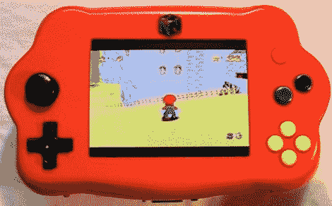

# 学习控制台黑客

> 原文：<https://hackaday.com/2010/04/28/learn-console%c2%a0hacking/>

这个鲜红色的掌机就是【菌氏】[便携式 N64 掌机](http://moddedbybacteria.wordpress.com/into64-portable-n64-console-system/)。我们开始觉得 N64 便携式黑客有点饱和，已经看到一个[看起来像游戏机](http://hackaday.com/2010/04/21/flaming-hot-brick-plays-games-promotes-tendonitis/)，另一个[在闪亮的黑色外壳](http://hackaday.com/2010/01/25/gorgeous-portable-n64-built-to-order/)，然而[在白色外壳](http://hackaday.com/2008/12/27/nintendo-sixtyfree-lite-r-portable-n64/)。这一次，它不仅仅是最终产品，而且[细菌]还发布了一篇讨论构建进度的长篇故事。在他的工作日志页面上查看 [20 个视频。如果您希望将现有硬件放入不同的机箱中，您应该充分利用这些资源来寻找您可以利用的想法。](http://moddedbybacteria.wordpress.com/retro-console-system-modding-guides/nintendo-n64-video-guide-log/)