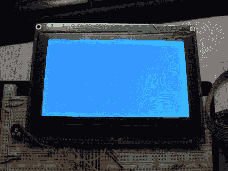

# 学习在图形 LCD 屏幕上绘制模拟时钟的几何图形

> 原文：<https://hackaday.com/2011/03/23/learn-the-geometry-to-draw-an-analog-clock-on-a-graphic-lcd-screen/>

上面的时钟图像是否让你害怕地闭上了快门，因为你需要使用数学来重新创建你自己的项目版本？我们当然明白高中几何正在成为一个非常遥远的记忆，但它真的没有你想象的那么难。[Janw] [用图形 LCD](http://www.instructables.com/id/Analog-clock-for-graphic-LCD) 制作了这个模拟时钟，他很好地解释了它背后的概念。

他使用的硬件对于一个电子业余爱好时钟来说是相当标准的；ATmega16、图形 LCD、DS1307 实时时钟以及电位计、电阻和按钮等支持硬件。代码是用 Bascom 编写的，但正如我们所说，[Janw]解释了在时钟上画指针背后的概念，所以你可以用任何你喜欢的微控制器或软件语言来重新创建它。我们建议拿一个计算器和一些白纸。我们试了几次才理清头绪，真正理解他在用每个方程做什么。