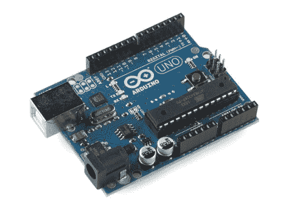

# 循序渐进地学习电子学概念

> 原文：<https://hackaday.com/2011/05/08/learning-electronics-concepts-step-by-step/>

我们意识到，并不是每个人都拥有电气工程学位，或者有能力仅凭味觉区分 NPN 晶体管和 PNP 晶体管，所以我们偶尔会提到一些对人群中的初学者有吸引力的东西。虽然 Arduino 的支持者和反对者之间存在明显的分歧，但很难否认这些设备有它们的位置，并且在探索某些电子概念时可能非常有用。

对于那里的支持者来说，[[约翰·鲍克夏尔]已经建立了一个挤满了 Arduino 教程的网站，涵盖了广泛的概念和技术](http://tronixstuff.wordpress.com/tutorials/)。我们已经报道过[在](http://hackaday.com/2011/02/05/going-cellular-with-your-arduino-projects/)之前关于特定主题的工作，但是我们觉得他的网站整体上值得一提。他的教程涵盖了一些最基本的概念，如用 Arduino 点亮 led，并一课一课地深入到更高级的主题。

他不满足于简单地介绍一个概念，并给出一个完成工作的草图。他花时间扩展概念，给读者足够的细节，以便在以后的项目中使用他们新发现的知识。如果你从头到尾跟着他的教程，你会接触到 LCD 屏幕控制、移位寄存器、实时时钟、I2C 总线通信等等。这些技能和概念可以应用到未来的项目以及其他微控制器中，这使得他的教程成为一个非常有价值的学习工具，值得一试。