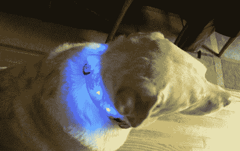

# LED 狗项圈

> 原文：<https://hackaday.com/2011/02/11/led-dog-collar/>

led 让一切变得更好，对吗？你的狗呢？[Ken]在他的一只活蹦乱跳的狗身上做了试验，这只狗每次带着一个 LED 狗项圈出来都喜欢跑。这是一个现成的狗项圈，带有 5 个蓝色 led，由 attiny2313 微控制器供电，使添加/改变灯光序列变得快速、简单，并允许未来升级。小 PCB 的制作有助于防止少量野生油炸。电子部件被封装在热胶中，整个装置由 3 节 AAA 电池供电。

虽然这是对该设备的早期测试，而且还会有更多的测试，就像[阳光]开门时的自动触发一样，但它似乎对在黑暗中追赶一只逃跑的狗有很大的帮助。

休息之后，请加入我们，观看一段简短的视频。

[https://www.youtube.com/embed/sZmrRN272gI?version=3&rel=1&showsearch=0&showinfo=1&iv_load_policy=1&fs=1&hl=en-US&autohide=2&wmode=transparent](https://www.youtube.com/embed/sZmrRN272gI?version=3&rel=1&showsearch=0&showinfo=1&iv_load_policy=1&fs=1&hl=en-US&autohide=2&wmode=transparent)