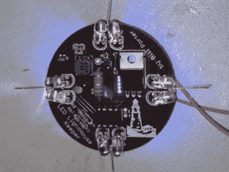

# LED 灯塔模拟器

> 原文：<https://hackaday.com/2010/12/27/led-lighthouse-simulator/>

今年圣诞节[比尔·波特]决定向他的父母证明这些大学费用花得值。他升级了他在高中时为花园喷泉设计的定制灯塔灯。他甚至为礼物制作了一些值得零售的包装。

我们认为这是一个很棒的设计，基于定制的 PCB，基于 ATtiny85。真正的灯塔有一个旋转的透镜来瞄准光束。当镜头扫过你的视点时，会有一个突然的闪光，他用 PWM 重新创造了这个效果。休息后看看视频，你就明白我们的意思了。

此外，在开发期间，他被一个启动故障[所困扰，这是我们在阅读](http://www.avrfreaks.net/index.php?name=PNphpBB2&file=viewtopic&t=100188&start=0&postdays=0&postorder=asc&highlight=&sid=c1862f79d1f946594bc2676deceac212)时偏离主题的。

[https://www.youtube.com/embed/ABZqw6FgMRQ?version=3&rel=1&showsearch=0&showinfo=1&iv_load_policy=1&fs=1&hl=en-US&autohide=2&wmode=transparent](https://www.youtube.com/embed/ABZqw6FgMRQ?version=3&rel=1&showsearch=0&showinfo=1&iv_load_policy=1&fs=1&hl=en-US&autohide=2&wmode=transparent)