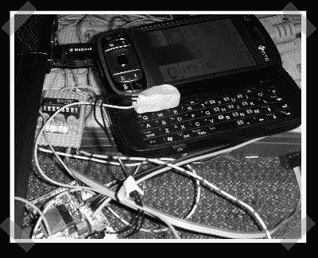

# 手机黑客的 LED 串行调试

> 原文：<https://hackaday.com/2008/06/28/led-serial-debugging-for-cell-phone-hacking/>

【Barry】需要某种方法来获得串行输出，以帮助调试他将 Linux 移植到 HTC tyt NII(Windows mobile Pocket PC phone)的工作。他写了一些代码，通过手机上的一个 led 发送[串行输出，并装配了一个 AVR 来接收输出，并提供一个 USB 接口给电脑。它以大约 200bps 的速度运行，非常适合快速调试会话。](http://www.headfuzz.co.uk/kaiserledhack)

*   [永久链接](http://www.headfuzz.co.uk/kaiserledhack)