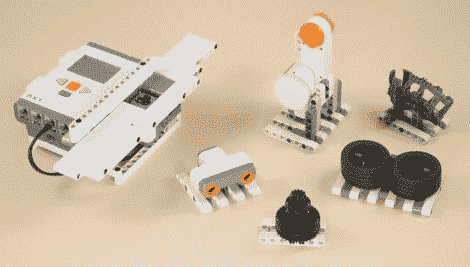

# 乐高条形码扫描仪

> 原文：<https://hackaday.com/2010/11/02/lego-barcode-scanner/>

玩商店变得非常非常有趣，因为你现在可以[建造自己的乐高条形码扫描仪](http://www.nxtprograms.com/NXT2/checkout_scanner/index.html)。正如你在休息后看到的，它工作得很好，像真正的条形码扫描仪一样快。不幸的是，它不能扫描真正的条形码。或者至少不是传统的。正如我们在[条形码挑战赛](http://hackaday.com/2009/10/08/barcode-challenge-part-2/)中了解到的，标准条形码是一组黑白条，组成代码的 1 和 0。该系统使用相同的白色和灰色条码系统，但似乎只有条码的数量才能识别物品，而不是由特定的明暗组合创建的代码。上面的项目都是可扫描的，因为扫描仪会计算每个包装底部的 2、3、4、5 或 6 个白色光束。尽管如此，如果得到一点帮助，它还是非常聪明的，是年轻黑客们的一个很好的玩具。

[https://www.youtube.com/embed/Q6UYW0hwKTg?version=3&rel=1&showsearch=0&showinfo=1&iv_load_policy=1&fs=1&hl=en-US&autohide=2&wmode=transparent](https://www.youtube.com/embed/Q6UYW0hwKTg?version=3&rel=1&showsearch=0&showinfo=1&iv_load_policy=1&fs=1&hl=en-US&autohide=2&wmode=transparent)

[通过[修补技术](http://tinkernology.blogspot.com/2010/10/barcode-scanner.html)