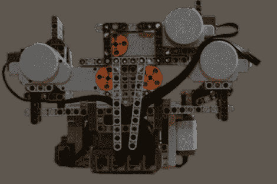

# 乐高针孔相机

> 原文：<https://hackaday.com/2010/12/30/lego-pinhole-camera/>

【Bshikin】用乐高积木 ( [翻译](http://translate.google.com/translate?js=n&prev=_t&hl=en&ie=UTF-8&layout=2&eotf=1&sl=auto&tl=en&u=http://habrahabr.ru/blogs/DIY/110725/))搭建了[一个针孔摄像头。由于 NXT 部件的集成，这是一个全自动装置。这需要一些仔细的计算来调整胶片间距以匹配焦距，并且需要相当多的胶带来防止光线进入胶片室。但最后，这是一个惊人的建设，采取体面的照片。该软件有胶片大小和速度的设置，并负责在点击按钮时曝光和推进画面。休息之后自己看吧。](http://habrahabr.ru/blogs/DIY/110725/)

如果你渴望更多的相机制作，看看这款从零开始制作的单反相机。

[https://www.youtube.com/embed/oqZrUQkX-SM?version=3&rel=1&showsearch=0&showinfo=1&iv_load_policy=1&fs=1&hl=en-US&autohide=2&wmode=transparent](https://www.youtube.com/embed/oqZrUQkX-SM?version=3&rel=1&showsearch=0&showinfo=1&iv_load_policy=1&fs=1&hl=en-US&autohide=2&wmode=transparent)

[谢谢瓦西里]