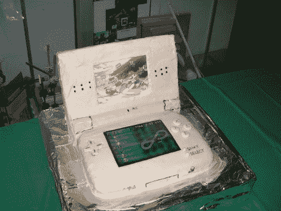

# 让蛋糕和电子游戏融为一体

> 原文：<https://hackaday.com/2011/03/01/let-there-be-cake-and-video-games-in-one-package/>

通过制作看起来像玩具的蛋糕来鼓励你的孩子玩他们的食物。任天堂 DS 外观相似的房屋一些电子设备来美化演示。上面的面板是覆盖着糖霜的硬纸板，与可食用的下面部分连接在一起。纸板面板隐藏了几个闪烁的 led，这要归功于与二极管串联的闪烁的圣诞灯泡。还有一个液晶显示屏背光的形式，以 CCFL 灯泡。屏幕只是一个静止的图像，但没关系，你不能指望一个实际的视频屏幕被内置到这一点。休息后看一下视频片段，了解内部情况。

我们过去也调查过一些其他的蛋糕黑客。如果你以前错过了它们，现在你有机会重游[基于龙门的糖霜分配器](http://hackaday.com/2011/01/05/cnc-cake-decorator/)和[带有银球细节的转盘糖霜注射器](http://hackaday.com/2010/10/16/computer-aided-cake-decoration/)。这些是一些可爱的黑客！

[https://www.youtube.com/embed/XD5SuS53iNY?version=3&rel=1&showsearch=0&showinfo=1&iv_load_policy=1&fs=1&hl=en-US&autohide=2&wmode=transparent](https://www.youtube.com/embed/XD5SuS53iNY?version=3&rel=1&showsearch=0&showinfo=1&iv_load_policy=1&fs=1&hl=en-US&autohide=2&wmode=transparent)