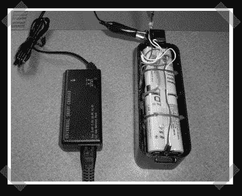

# 您的 Roomba 锂离子电池

> 原文：<https://hackaday.com/2008/03/15/li-ion-for-your-roomba/>

【gim】[掏空了一些锂离子笔记本电池来替换他的 roomba 的电池组。他不得不拿起一个锂离子充电器，并添加一个保护电路来处理锂离子电池，但最终为他的 roomba 提供了一个新的更轻的包。如果你朝这个方向走，保护电路是防止火灾/爆炸等的重要组成部分。看起来像是机器人动力甚至 R/C 项目的伟大资源。](http://www.cs.brandeis.edu/~gim/RoombaLi-ion/)

*   [永久链接](http://www.cs.brandeis.edu/~gim/RoombaLi-ion/)