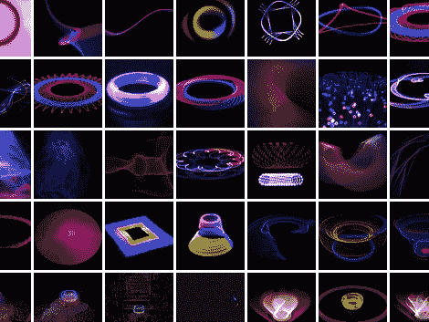

# 光绘–静态照片和动画

> 原文：<https://hackaday.com/2011/05/05/light-painting-still-shots-and-animations/>

(金·皮梅尔)用 Arduino 做了一些非常有趣的[光绘。在过去，我们已经看到了几个光绘项目，它们使用](http://www.flickr.com/photos/djspyhunter/sets/72157615077454920/)[长曝光来捕捉移动的 led](http://hackaday.com/2011/03/02/how-to-find-wifi-carry-a-big-stick-and-use-long-exposures/)，或者[移动的 LCD 显示屏](http://hackaday.com/2010/09/17/3d-digital-light-art-using-ipad-and-camera-trickery/)。但是[金的]更上一层楼，使用冷阴极荧光灯、电致发光(EL)线和激光。这些来源提供的鲜艳色彩造就了一些很棒的照片，但这并不是她所有的锦囊妙计。在从各种拍摄中积累了大量静态照片后，她决定将它们编辑成定格视频。

休息之后，你可以看到她用来制作这些图像的一种方法是在标准音频转盘上旋转光源。Arduino 通过蓝牙进行处理控制，以便在唱机旋转时移动安装在步进电机上的灯。多亏了蠢朋克，加上一些未来派音乐(这正是她所做的)，你就成功了。

【维梅奥 http://vimeo.com/14980662 w = 470】

[感谢 [@littlebirdceo](https://twitter.com/#!/littlebirdceo/status/65918388542771200) 通过 [Arduino 博客](http://arduino.cc/blog/2011/05/04/light-drive-light-painting-with-arduino/)