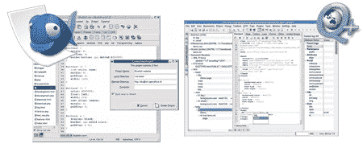

# Linux Web 开发工具

> 原文：<https://hackaday.com/2008/06/10/linux-web-development-tools/>

Download Squad 一直在发布一个关于切换到 Linux 的信息系列，他们的最新文章是关于[Linux 上 web 工具的好处](http://www.downloadsquad.com/2008/06/09/flipping-the-linux-switch-linux-web-tools-and-html-editors-pt/)。

HTML 编辑器，如 [Bluefish](http://bluefish.openoffice.nl/) 和 [Quanta](http://quanta.kdewebdev.org/) 并不具备 Dreamweaver 的所有功能，但对于许多现代 CMSes 来说，这些功能并不是真正必要的。

其他好处包括在您的 Linux 家庭环境中测试 web 页面，以及添加 web 主机作为远程位置。这使得管理、测试和部署更加容易，并且可以消除对 FTP 软件的需求。

请记住，这篇文章只是正在进行的 Linux web 工具系列的第一部分，它本身是关于切换到 Linux 的更大系列的一部分。

*   [永久链接](http://www.downloadsquad.com/2008/06/09/flipping-the-linux-switch-linux-web-tools-and-html-editors-pt/)