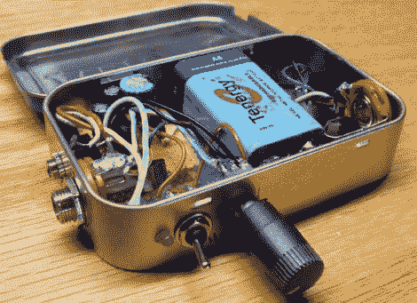

# LM386 Altoids 锡放大器

> 原文：<https://hackaday.com/2011/05/01/lm386-altoids-tin-amp/>

黑客[迪诺·塞戈维斯]带着他的“每周黑客”系列的第五部再次归来。这一次，他组装了一个 1/2 瓦的音频放大器，这将是一个很好的周末项目。他是 LM386 放大器芯片的忠实粉丝，因为它在如此小的封装中实现了如此多的功能。因为它是如此的多才多艺，他用它作为他的 Altoids 锡放大器的核心。

现在，Altoids 罐[中的音频放大器并不是一个新概念](http://hackaday.com/2005/01/17/diy-portable-amp-for-beginners/)，但【Dino】花时间详细讨论了电路，这对任何正在寻找有趣且相对简单的项目的初学者来说都是很好的选择。在组装过程的高速视频之后，他带我们看了完整的放大器，然后给我们看了几个简短的演示。

他的放大器与我们过去见过的其他放大器不同的一点是增加了 1/4”吉他插孔，这允许他将他的放大器用作组合放大器/失真效果盒。

这是另一项出色的工作，所以如果你想完整地观看最新的《黑客一周》一集，请务必继续阅读。

[https://www.youtube.com/embed/3KyBrAoHMX8?version=3&rel=1&showsearch=0&showinfo=1&iv_load_policy=1&fs=1&hl=en-US&autohide=2&wmode=transparent](https://www.youtube.com/embed/3KyBrAoHMX8?version=3&rel=1&showsearch=0&showinfo=1&iv_load_policy=1&fs=1&hl=en-US&autohide=2&wmode=transparent)