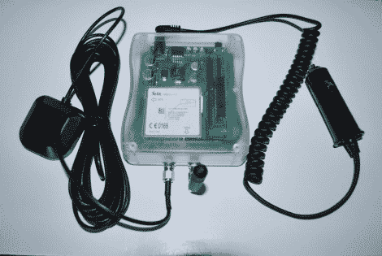

# 使用 Twitter 和谷歌地图进行位置跟踪

> 原文：<https://hackaday.com/2010/09/08/location-tracking-with-twitter-and-google-maps/>

【瑞安·奥哈拉】[制造了一个他可以在摩托车旅行中使用的位置跟踪器](http://ohararp.com/wp/?p=119)。表面上看，这是为了让他的妻子放心，我们认为这是玩 GPS 和 SMS 的借口。为了经受住道路的考验，[Ryan]将他的试验板原型提升到了一个新的水平，使用了一个人造板和一个 SparkFun 外壳。一张 PIC 18F25K20 被安全地藏了起来，它从 GM862 上收集经度和纬度，将信息格式化成谷歌地图链接，并通过短信发送给推特信息[。如果你不熟悉 GM862，除了作为 GPS 模块之外，它还可以在 GSM 网络上发送和接收蜂窝数据。](http://twitter.com/ohararp_f800gs)

这是一个很好的坚实的硬件平台，从中我们可以想象一些其他的黑客。该提要可以被解析为一个漂亮的地图图形，就像推特公路车的网页一样。如果有一个 d-pad 和字符 LCD，可以在一天结束时将自己的推文发布到 feed，这可能也不错。