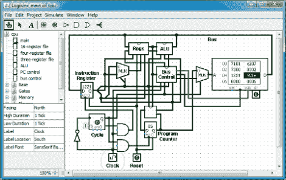

# Logisim:开源数字逻辑模拟器

> 原文：<https://hackaday.com/2011/02/09/logisim-open-source-digital-logic-simulator/>

[Spi Waterwing]写信来确保我们了解 Logisim，[一个基于 Java 的开源数字逻辑模拟器](http://ozark.hendrix.edu/~burch/logisim/index.html)。我们过去经常使用[阿塔努阿](http://hackaday.com/2008/12/18/7400-series-logic-simulator/)，但从未听说过这个程序。它似乎有一个相当[大的教育跟随](http://ozark.hendrix.edu/~burch/logisim/usage.html)，并且马上它有了一个我们一直想要的功能，构建你自己的‘黑盒’逻辑设备的能力。也就是说，你可以用逻辑门构建自己的电路，然后将其封装成一个部件，用于下一个设计。它没有我们习惯使用的 Atanua 系列逻辑芯片，但如果您真的需要这种功能，您可以使用黑盒功能构建自己的芯片。

所以拿一份拷贝，试着构建上个月的二进制计算器项目。