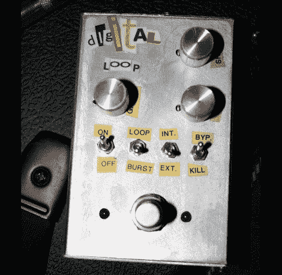

# 环形脚踏板

> 原文：<https://hackaday.com/2010/02/23/looping-foot-pedal/>

[这个吉他踏板](http://www.instructables.com/id/Homebrew-Digital-Effects-Pedal)可以录音、回放、修改样本。[科林·默克尔]，也因[而闻名，他在电子门锁](http://hackaday.com/2009/10/09/adding-a-keypad-to-a-key-card-lock/)上的工作，建造了这个来复制他在录音中听到的一些吉他效果。用脚轻触底部的按钮，设备开始记录。另一个点击停止录音并开始循环。这是其余控制接管的地方，通过设置来调整回放速度、音量和回放循环的类型。休息后的视频很好地展示了这些特性。

[Colin]围绕 PIC 18F877A 构建了这个，带有 256k RAM 芯片来存储样本。有一堆其他组件进入这个，我们目瞪口呆，他在 protoboard 上建立它。对我们来说，这将是一个多试验板原型，我们不会再考虑布局和蚀刻我们自己的 PCB。他承认点对点焊接将他的技能发挥到了极限，但他没有说电路启动和运行花了多少时间。这是对我们在这里看到的[酷吉他踏板](http://hackaday.com/2008/06/15/game-boy-foot-controller-demo/)的一个很好的补充。

[https://www.youtube.com/embed/R1ZOEZFlNzE?version=3&rel=1&showsearch=0&showinfo=1&iv_load_policy=1&fs=1&hl=en-US&autohide=2&wmode=transparent](https://www.youtube.com/embed/R1ZOEZFlNzE?version=3&rel=1&showsearch=0&showinfo=1&iv_load_policy=1&fs=1&hl=en-US&autohide=2&wmode=transparent)