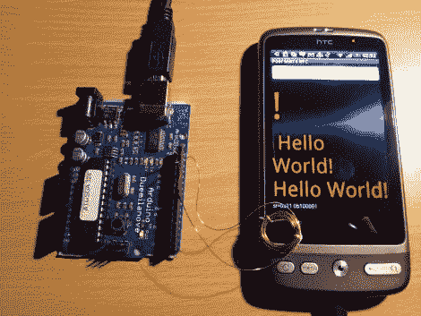

# 低成本、低带宽的无线 Arduino 到 Android 通信

> 原文：<https://hackaday.com/2011/05/27/low-cost-low-bandwidth-wireless-arduino-to-android-communications/>

[Joe]在试验他的 Arduino 时，他开始思考如何让它与他的 Android 手机进行无线通信。蓝牙是一个选项，但它需要一些额外的组件，谷歌的 ADK 也可以工作——只是不是无线的。

相反，他认为看看他能否用一个简单的磁线圈让这两个设备进行通信会很有趣。他构建了一个直径 1 厘米的小线圈，通过电阻和二极管将其连接到 Arduino。使用 Android Tricorder 应用程序，他能够定位他手机的磁力计，之后他进行了一些测试，以缩小通信的最佳采样率和频率范围。

为了在两个设备之间传输数据，他必须在软件中对信号进行 bit bang，因为 Arduino 的 UART 下限远远快于他用磁力计能够实现的 7 bps 数据速率。

虽然他的无线 Arduino to Android bridge 不太可能在吞吐量方面获得任何奖项，但它是一个很好的概念验证项目。一定要看看下面的视频，看看他的“穷人的 NFC”在行动。

[https://www.youtube.com/embed/FBT4h7RW0wA?version=3&rel=1&showsearch=0&showinfo=1&iv_load_policy=1&fs=1&hl=en-US&autohide=2&wmode=transparent](https://www.youtube.com/embed/FBT4h7RW0wA?version=3&rel=1&showsearch=0&showinfo=1&iv_load_policy=1&fs=1&hl=en-US&autohide=2&wmode=transparent)