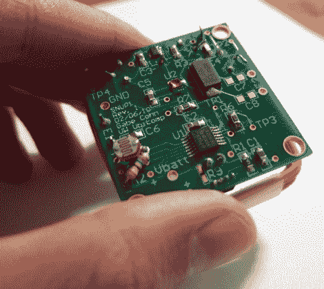

# 低功耗无线家庭自动化传感器

> 原文：<https://hackaday.com/2010/09/16/low-power-wireless-home-automation-sensors/>

最近，严肃的研究和执行良好的黑客之间的界限变得相当模糊。上面的设备可能是在你的地下室设计的，但它实际上来自华盛顿大学的研究人员。他们正在研发低功耗家庭自动化传感器，用于监控湿度、温度、空气质量和光线等。他们研究的重点是利用家庭的电力系统进行无线通信。以 27 MHz 的频率运行已经被证明是非常有效的，以至于这些模块中的一个被放置在电气线路 10-15 英尺内就可以与家里的其他部分进行通信，仅由预计可以持续十年的手表电池供电。

这有点令人兴奋，生产和分发一套这样的小电路板比在整个房子里布线要容易得多。现在我们只需要将它与空军的寄生电力系统结合起来，就完全不需要电池了。

[谢谢西汉特]