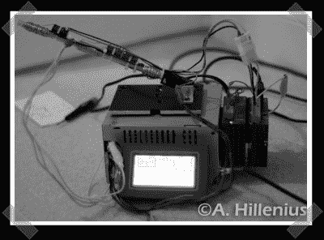

# 低压线圈枪

> 原文：<https://hackaday.com/2008/03/18/low-voltage-coil-gun/>

【安德鲁】派在[手下的](http://www.projects.clanscripts.us/index.php?topic=2.0)低压线圈炮。他使用了一些大多数硬件黑客可能没有的控制硬件，但这仍然是一个很好的概念证明。每个线圈由一个专用继电器驱动，一个 PC 电源为系统供电，而一个可编程逻辑控制器完成这项工作。因为这只是按顺序触发线圈的问题，PLC 可以很容易地被微控制器取代。

*   [永久链接](http://www.projects.clanscripts.us/index.php?topic=2.0)