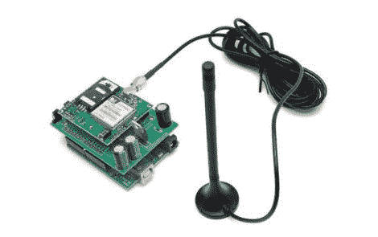

# 低成本 Arduino 电池屏蔽

> 原文：<https://hackaday.com/2011/03/24/lower-cost-arduino-cell-shield/>

人们喜欢把他们的 Arduinos 放在有趣和偏远的地方。虽然这是可能的，但是从设备中耗尽并收集数据可能是不实际的。这就是这个 [GSM / GPRS 屏蔽](http://www.open-electronics.org/arduino-gsm-shield/)派上用场的地方。

基于 SIMCom SIM900，这款设备的价格较低(模块 49 欧元，分线板上安装的模块约 60 欧元，或约 85 美元)，这使得该模块成为任何想要为项目添加手机连接的人的兴趣目标。

为了更进一步，[Boris]为 Arduino 和 Arduino like footprint 用户设计了一个漂亮的屏蔽 PCB，使 900 分线板和 Arduino 布局之间的连接变得轻而易举。电学上它只是电线，和一个 LM317。