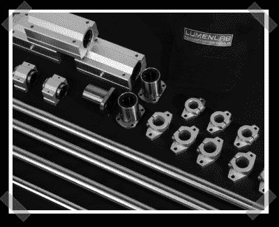

# Lumenlab 的新套件:开源 CNC

> 原文：<https://hackaday.com/2008/05/23/lumenlabs-new-kit-open-source-cnc/>

想象一下当我们偶然发现[最新的 Lumenlab 项目](http://www.lumenlab.com/robotics/):龙门式 CNC 时的惊喜。到目前为止，我们唯一一次提到他们的名字是为了 [DIY 投影仪](http://www.hackaday.com/2008/05/22/projector-hacks-roundup/)。该套件看起来非常有趣，他们现在接受预订。它是为全尺寸刳刨机设计的，您应该能够用送纸辊切割 4 英尺乘 8 英尺的纸张。即使没有，切割区域也是一个 26″乘 50″的大区域，并且具有 8″的 Z 移动。在他们的工具包和来自在线金属的订单之间，他们预计你可以花大约 1000 美元建立自己的工具包。当最终套装在六月发布时，我们肯定会加入。

*   [永久链接](http://www.lumenlab.com/robotics/)