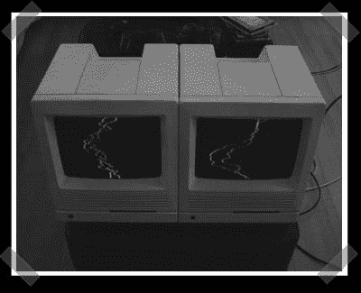

# Mac SE/30 音频可视化工具

> 原文：<https://hackaday.com/2006/11/05/mac-se30-audio-visualizer/>

当然，你可以[把它做成网络服务器](http://www.hackaday.com/2005/07/06/mac-se-30-linux-web-server/)，但是【马基】把他的 [Mac SE/30 可视化器](http://geektechnique.org/projectlab/707/how-to-make-mac-se30-audio-visualizers)发给了我。它的灵感来自于另一个人的 mac mod，但他还是好心地写了一整篇操作指南。音频信号直接进入 macs 电子管的偏转线圈。mod 是如此简单，我可能不得不选择一个来做 CRT 实验。

【下一个常规播客来了，但是因为感冒耽误了。]

*   [永久链接](http://geektechnique.org/projectlab/707/how-to-make-mac-se30-audio-visualizers)