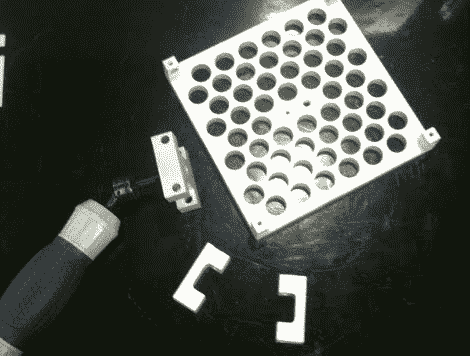

# 机械加工的摄影机稳定器，比其他产品更稳定

> 原文：<https://hackaday.com/2010/09/21/machined-steadicam-steadier-than-the-rest/>

不，上面的图片不是商店制作的 steadicam。确切地说，[一台 CNC 加工的](http://mattscontraptions.blogspot.com/2010/09/steadicam-clone.html)由【Matt】生产。有趣的是，与我们之前见过的大多数稳定凸轮[不同的是](http://hackaday.com/2009/07/15/gimbal-camera-stabilizer/)万向架是*而不是*设计的主要焦点尽管铝加工万向架会让我们流口水。中心思想是允许 X 和 Y 轴调整，以获得奇怪的重量庞大的相机的准确重心。[Matt's] steadicam 的设计也比商业版本能承受更大的重量，而且(如果你已经有一台 CNC 的话)要便宜得多。没有视频，但从工艺技巧来看，我们可以有把握地认为它和一些最好的一样好，一样水平。