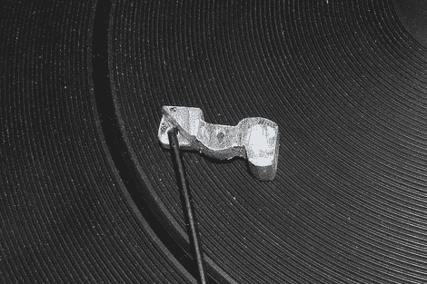

# 用手工工具加工替换零件

> 原文：<https://hackaday.com/2011/05/11/machining-replacement-parts-with-hand-tools/>

杰夫是一个超级音乐迷，像我们许多人一样喜欢旧技术，所以(对他来说)他没有转台似乎有点傻。他爸爸在地下室有备用的。一辆 20 世纪 70 年代的整洁的旧博朗车坏了。

打开机器后，他发现手臂的部分机械装置坏了，由于转盘的老化和大规模生产的奇迹，找到替代品的可能性微乎其微。他毫不气馁，拿出手动工具，用一些铝做了替代品。最终结果是一个完美的功能转盘，将服务更多小时推出热果酱。

查看上面的 fourm 帖子以获取详细信息和图片，我们只想告诉[Jeff]，干得好！