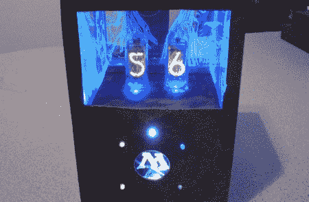

# 魔法:聚集的谢妮生命计数器

> 原文：<https://hackaday.com/2011/07/21/magic-the-gathering-nixie-life-counter/>

有人给了我们一个提示，让我们看到了这个魔法:聚集论坛的帖子，一个名叫[DistortedDesigns]的用户为魔法做了一个生命计数器:谢妮管的聚集。虽然这个版本没有太多的细节，但它实在太酷了，不能在一个论坛中被遗忘。

这个项目从蚀刻一些树脂玻璃开始。有一些[早期的例子](http://hackaday.com/wp-content/uploads/2011/07/sign.jpg)【失真设计】的作品看起来非常专业。电子设备非常简单——25 个 led 使用 2 节 AA 电池，nixies 使用 2 节 C 电池。我们想知道[失真设计]什么时候会投放[原子弹](http://hackaday.com/tag/arduino/)，但是看起来这个版本没有使用微控制器。

控制器又回来了，是给 led 和 nixies 供电的拨动开关。背面有两个旋钮，从文字上很容易推断出这些是 10 位旋转开关。[DistortedDesigns]说，“后面的旋钮旋转，一次为一个数字供电，”所以对于变压器来说，这似乎是一个非常简单的构建。

这是一个优秀的构建，但当它的作者发布它时，并没有得到足够的关注。如果你知道任何被低估的构建，请发送到[发送到我们的提示行](http://hackaday.com/contact-hack-a-day/)。